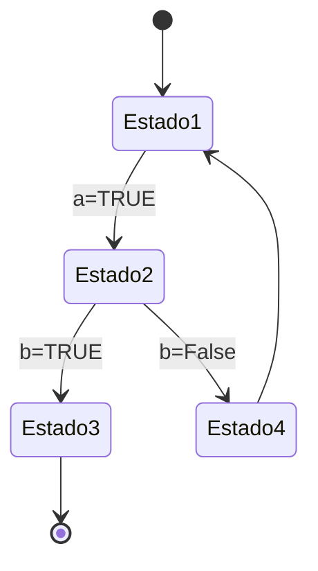
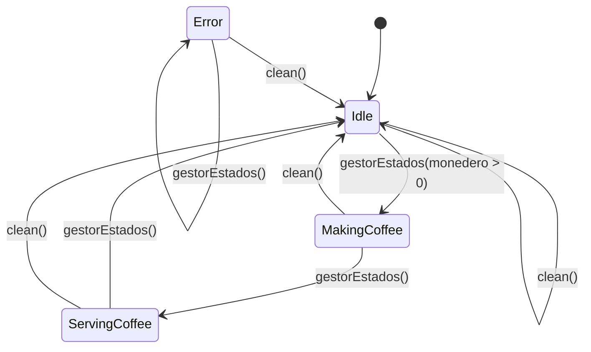

# Máquina de Estados... de Café

## Diagrama ejercicio previo

```mermaid
stateDiagram-v2
    [*] --> Estado1
    Estado1 --> Estado2: a=TRUE 
    Estado2 --> Estado3: b=TRUE
    Estado2 --> Estado4: b=False
    Estado3 --> [*]
    Estado4 --> Estado1
```

## Diagrama Máquina

```mermaid
stateDiagram-v2
    [*] --> Idle
    Idle --> MakingCoffee : gestorEstados(monedero > 0)
    Idle --> Idle : gestorEstados(monedero <= 0)
    MakingCoffee --> ServingCoffee : gestorEstados()
    ServingCoffee --> Idle : gestorEstados()
    Error --> Error : gestorEstados()
    Idle --> Idle : clean()
    MakingCoffee --> Idle : clean()
    ServingCoffee --> Idle : clean()
    Error --> Idle : clean()
```